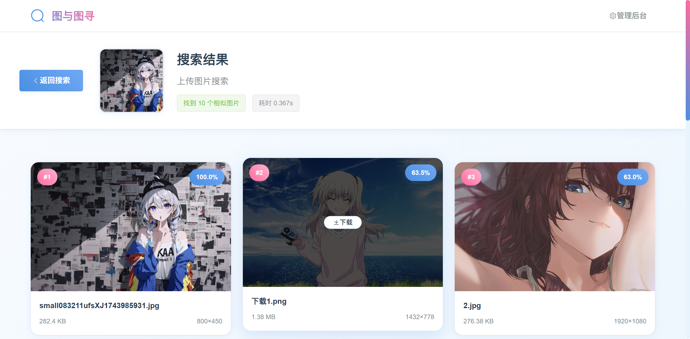
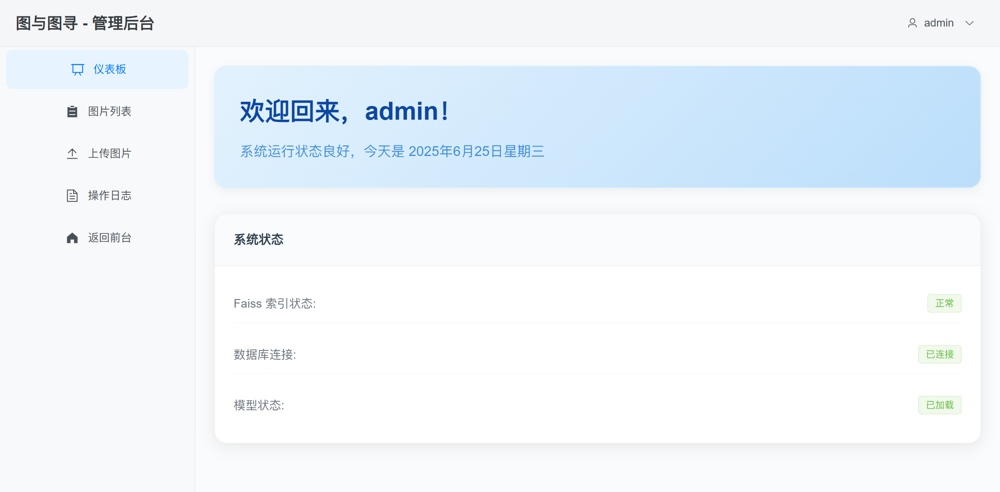

<h1 align="center">图与图寻</h1>

<p align="center">

</p>

<p align="center"><b>基于 Faiss 的以图搜图系统，支持相似图像检索和图像数据集管理</b></p>

## 项目简介
本项目是一个基于深度学习与 Faiss 构建的图像检索系统，允许您通过浏览器轻松地管理自己的图像数据集，并进行检索。
系统利用了 PyTorch 加载预训练的深度学习模型（如 ResNet）来提取精确的图像特征，结合 Faiss 实现毫秒级的海量图片相似度匹配与查找。

## 支持的功能

- 图像数据集导入和管理
- 基于内容的图像检索
- 检索结果 TOP-K 展示

## 技术栈

### 前端
- 框架: Vue 3
- UI组件: Element Plus
- 状态管理: Pinia
- 路由: Vue Router
- HTTP客户端: Axios

### 后端
- 框架: FastAPI
- 图像处理: PyTorch + torchvision
- 特征提取: 预训练ResNet模型
- 相似度检索: Faiss
- 数据库: MySQL
- 文件存储: 本地文件系统

### 基础设施
- 配置管理: YAML
- 认证: JWT Token
- 日志: Python logging

## 快速开始

### 环境要求
- Python 3.8+
- Node.js 16+
- MySQL 8.0+
- 推荐：CUDA支持的GPU（可选，用于加速）

### 一键安装
```bash
# 运行安装脚本
chmod +x install.sh
./install.sh
```

### 手动安装

#### 1. 克隆项目
```bash
git clone https://github.com/ldqk/ImageSearch.git
cd faiss-image-search-v3
```

#### 2. 后端设置
```bash
cd backend
pip install -r requirements.txt
```

#### 3. 前端设置
```bash
cd frontend
npm install
```

#### 4. 数据库初始化
```bash
# 创建数据库和表结构
mysql -u root -p < config/database.sql
```

#### 5. 配置文件
编辑 `config\\config.yaml`，修改数据库连接信息：
```yaml
database:
  host: "localhost"
  port: 3306
  username: "your_username"
  password: "your_password"
  database: "pic_search"
```

### 启动服务

#### 方式一：使用启动脚本
```bash
# 启动后端（开发模式）
python scripts/start.py --reload

# 启动前端
cd frontend && npm run dev
```

#### 方式二：手动启动
```bash
# 启动后端
python backend/main.py

# 启动前端（新终端）
cd frontend
npm run dev
```

## 示例效果
<p>
  
  
  
  
</p>


## 管理后台说明
默认账号：admin / admin123

## 访问地址

- 前端应用: http://localhost:3000
- 后端API: http://localhost:8000
- API文档: http://localhost:8000/docs
- 管理后台: http://localhost:3000/admin


## 许可证

MIT License 


